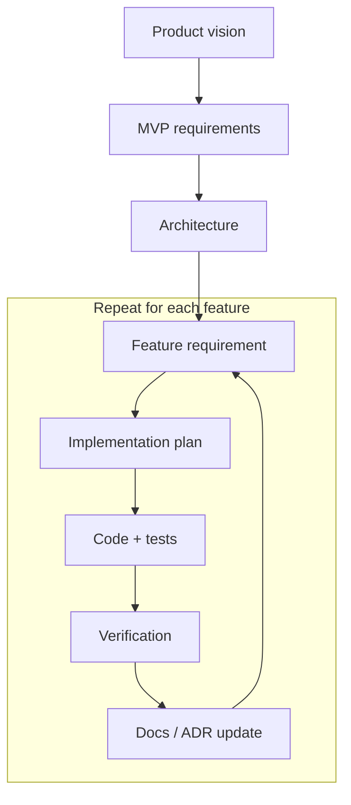

# Bootstrap prompt

The journey to find the ultimate prompt to start all coding agent-assisted
projects.

## How to use

Paste this into the coding agent's chat box:

```
Follow the instructions in this document: https://raw.githubusercontent.com/tbumi/thpd-bootstrap/refs/heads/main/project-bootstrap-prompt.md
Be sure to read the document in full.
```

## Canonical flow


